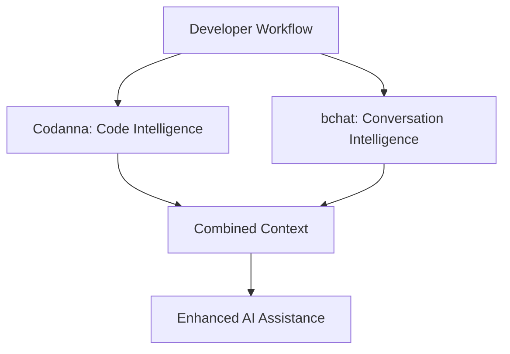

# 08-250813 - bchat vs Codanna Semantic Code Intelligence Analysis

**Date**: 2025-08-13  
**Stage**: ST_06 bchat Vision  
**Focus**: Production-Ready Code Intelligence vs bchat's Context Sharing Approach  

## Repository Overview

**Codanna**: Semantic code search and relationship tracking via MCP and Unix CLI  
**Author**: Angel Bartolli  
**Repository**: https://github.com/bartolli/codanna  
**Version**: 0.3.0 (Production Release)  
**Language**: Rust (Performance-optimized)  

## Architecture Comparison

### Codanna's Architecture ⚡
```rust
// Production-grade semantic code intelligence
1. **Parse** - Tree-sitter AST parsing (Rust/Python/JS)
2. **Extract** - Symbols, call graphs, implementations, relationships
3. **Embed** - 384D vectors via AllMiniLML6V2 
4. **Index** - Tantivy full-text + memory-mapped symbol cache (<10ms lookups)
5. **Serve** - MCP protocol (~300ms response time)
```

### bchat's Architecture 🔄
```python
# Conversation intelligence and context sharing
1. **Monitor** - Chat log creation via shell monitoring
2. **Index** - JSON-based conversation storage
3. **Search** - Simple keyword matching in chat history
4. **Share** - MCP server for cross-AI context awareness
5. **Serve** - Context retrieval for multi-AI workflows
```

## Core Differences Analysis

### Problem Domains

| Aspect | Codanna | bchat |
|--------|---------|-------|
| **Primary Focus** | Code semantic understanding | AI conversation continuity |
| **Data Source** | Source code files (AST) | Chat logs (conversations) |
| **Search Target** | Functions, symbols, relationships | Past decisions, context, workflow |
| **User Workflow** | Code exploration and navigation | Multi-AI session management |
| **Intelligence Type** | Static code analysis | Dynamic conversation patterns |

### Technical Implementation

| Component | Codanna | bchat |
|-----------|---------|--------|
| **Language** | Rust (performance) | Python (rapid development) |
| **Parsing** | Tree-sitter AST | JSON chat logs |
| **Storage** | Tantivy + memory-mapped cache | Simple JSON files |
| **Embeddings** | AllMiniLML6V2 (384D vectors) | Keyword-based search |
| **Response Time** | <10ms (symbol lookup), ~300ms (semantic) | Variable (simple keyword matching) |
| **Index Size** | Optimized binary format | Human-readable JSON |

### MCP Integration Approaches

#### Codanna's MCP Tools
```json
{
  "search": "Semantic code search across indexed codebase",
  "symbols": "List functions, classes, types in scope", 
  "relationships": "Find callers, callees, implementations",
  "index_info": "Statistics about indexed code",
  "watch": "Real-time file system monitoring"
}
```

#### bchat's MCP Tools
```json
{
  "search_context": "Find relevant conversation history",
  "echo": "Test MCP connectivity"
}
```

## Complementary Potential 🤝

### Different Problem Spaces
- **Codanna**: "What functions does this code define?" 
- **bchat**: "What did we decide about this feature last week?"

### Integration Opportunities
```python
# Hypothetical unified intelligence
def enhanced_context_search(query):
    # 1. Codanna: Find relevant code symbols
    code_context = codanna.search(query, scope="current_project")
    
    # 2. bchat: Find relevant conversation history  
    chat_context = bchat.search_context(query, provider="claude")
    
    # 3. Combined intelligent response
    return combine_contexts(code_context, chat_context)
```

## Comparative Strengths

### Codanna Advantages ✅
- **Production-Ready**: Version 0.3.0 with active development
- **Performance**: <10ms symbol lookups, optimized Rust implementation
- **Comprehensive**: Full semantic understanding of code structure
- **Scalable**: Handles large codebases efficiently
- **Rich Features**: AST parsing, relationship tracking, real-time monitoring

### bchat Advantages ✅
- **Unique Niche**: AI conversation continuity (no direct competitors)
- **Simplicity**: JSON-based, easy to understand and modify
- **Multi-AI**: Cross-platform context sharing (Claude + Gemini)
- **Workflow-Focused**: Understands development decision patterns
- **Lightweight**: Minimal resource requirements

## Integration Assessment for bchat

### What bchat Should NOT Copy ❌
- **Complex AST Parsing**: Outside bchat's conversation focus
- **Vector Embeddings**: Over-engineering for current MVP
- **Performance Optimization**: Premature for bchat's scale
- **Binary Storage Formats**: Conflicts with transparency goals

### What bchat Could Learn ✅
- **Response Time Optimization**: Aim for consistent <300ms responses
- **Memory-Mapped Caching**: For larger conversation histories
- **Real-Time Monitoring**: File system watches for immediate updates
- **Structured Output**: JSON responses optimized for MCP consumption

## Implementation Recommendations

### Phase 1: Immediate Improvements (Inspired by Codanna)
```python
# Add to bchat's context_engine.py
class OptimizedChatIndexSearcher:
    def __init__(self):
        self.response_time_target = 300  # ms (like Codanna)
        self.cache = {}  # Simple in-memory cache
        
    def search_with_timing(self, query):
        start_time = time.time()
        results = self.search(query)
        response_time = (time.time() - start_time) * 1000
        return {
            "results": results,
            "response_time_ms": response_time,
            "cache_hit": query in self.cache
        }
```

### Phase 2: Architecture Learning (Not Code Copying)
- **Response Time Monitoring**: Track search performance
- **Cache Strategy**: Simple in-memory caching for frequent queries
- **Structured Responses**: Consistent JSON output format
- **Error Handling**: Production-grade error responses

## Strategic Positioning

### Codanna's Market Position
- **Target**: Developers seeking code intelligence
- **Competes With**: GitHub Copilot, Sourcegraph, code LSPs
- **Value Prop**: Fast, local, semantic code understanding

### bchat's Market Position  
- **Target**: Developers using multiple AI assistants
- **Competes With**: No direct competitors (unique niche)
- **Value Prop**: Conversation continuity across AI platforms

### Symbiotic Relationship Potential


## Lessons for bchat Development

### Architecture Principles
1. **Performance Matters**: Codanna's <10ms lookups show users expect speed
2. **Production Quality**: Version 0.3.0 represents serious engineering investment
3. **Focused Scope**: Codanna does code intelligence extremely well by staying focused
4. **MCP-First Design**: Both tools designed specifically for AI assistant integration

### Development Methodology Insights
1. **Rust for Performance**: When speed matters, language choice is critical
2. **Memory-Mapped Storage**: Efficient for read-heavy workloads
3. **Real-Time Updates**: File system monitoring for immediate responsiveness
4. **Rich Error Handling**: Production systems need comprehensive error responses

## Conclusion: Complementary Excellence

**Codanna** and **bchat** solve different but complementary problems:

- **Codanna**: "Understanding code structure and relationships"
- **bchat**: "Understanding development conversation patterns and decisions"

**Integration Opportunity**: Future bchat versions could integrate with Codanna to provide **unified development context** - combining code intelligence with conversation intelligence.

**Current Focus**: Maintain bchat's unique conversation intelligence niche while learning performance and architecture lessons from Codanna's production-ready implementation.

**Key Takeaway**: Both tools represent the future of AI-assisted development - specialized intelligence systems that enhance human-AI collaboration through the MCP protocol.

## Relationship to Previous ST_06 Work

### Relevant Foundation Documents (Still Applicable)
- **07-250812-bchat-vs-claude-self-reflect.md** - External repository analysis methodology ✅
- **09-250813-practical-integration-plan.md** - KISS MVP implementation approach ✅

### Implementation Alignment
This analysis **supports the objectives** defined in previous ST_06 documents:
- **Architecture Learning**: ✅ Study production-ready MCP implementations
- **Scope Clarity**: ✅ Reinforces bchat's unique conversation intelligence focus
- **Performance Awareness**: ✅ Establishes response time targets for bchat
- **Integration Potential**: ✅ Identifies future collaboration opportunities

**Conclusion**: Codanna represents what production-ready code intelligence looks like, providing architectural lessons for bchat while confirming bchat's unique position in AI conversation continuity.