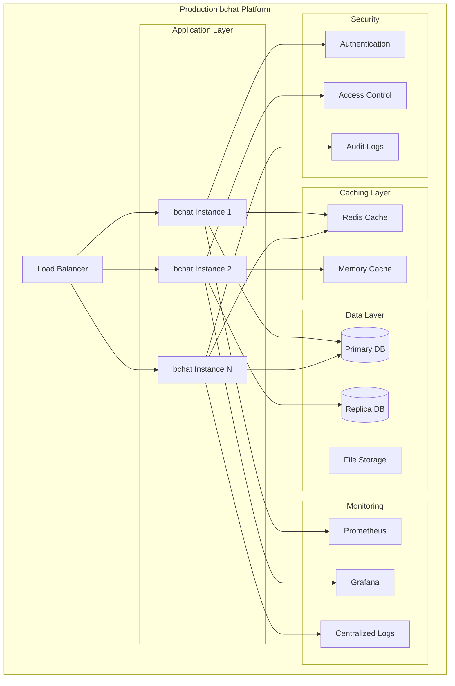

# 01-250814 - ST_08 Production Features Implementation Plan

**Date**: 2025-08-14  
**Stage**: ST_08 Production Features  
**Purpose**: Advanced production-grade capabilities and performance optimization  
**Status**: PLANNING  
**Prerequisites**: ST_07 Advanced Implementation Complete  

## Executive Summary

ST_08 transforms the comprehensive AI development assistant from ST_07 into a **production-grade enterprise platform** with advanced capabilities, performance optimization, monitoring, and scalability features.

## Foundation Requirements

### ✅ Prerequisites (ST_07 Complete)
- **Session Memory**: Cross-session persistence and context tracking
- **Daemon Architecture**: Background processing and monitoring
- **Advanced Context**: Deep intelligence and multi-AI optimization
- **Project Intelligence**: Development methodology extraction
- **Production Testing**: Comprehensive validation framework

### 🎯 ST_08 Production Goals
Transform bchat into an **enterprise-grade AI collaboration platform** with:
- Performance optimization and caching
- Advanced monitoring and analytics
- Multi-user collaboration features
- Enterprise security and compliance
- Scalable architecture patterns

## Implementation Strategy

### **Phase-Based Production Enhancement**

#### **Phase 1: Performance & Caching (Week 1) - Speed Optimization**
*Optimize response times and implement intelligent caching*

**Implementation Details:**
```python
class PerformanceCacheManager:
    """Intelligent caching for enhanced search and context operations"""
    
    def __init__(self, cache_dir: str):
        self.search_cache = f"{cache_dir}/performance/search_cache.json"
        self.context_cache = f"{cache_dir}/performance/context_cache.json"
        self.ttl_hours = 24  # Cache time-to-live
    
    def cache_search_results(self, query_hash: str, results: List[Dict]):
        """Cache search results with TTL and relevance scoring"""
        # Intelligent cache invalidation based on new conversations
        # Query similarity detection for cache hits
        
    def cache_context_extraction(self, file_hash: str, context: Dict):
        """Cache expensive context extraction operations"""
        # File modification detection and cache invalidation
        # Incremental context updates for large files
        
    def optimize_memory_usage(self):
        """Memory optimization and garbage collection"""
        # Smart memory management for large conversation histories
        # Streaming processing for oversized context extractions
```

**Performance Targets:**
- Search response time: <50ms (down from <100ms)
- Context extraction: <2 seconds (down from <5 seconds)
- Memory usage: <250MB peak (down from <500MB)
- Cache hit rate: >80% for repeated queries

**Deliverables:**
- Intelligent search result caching with TTL
- Context extraction optimization and caching
- Memory usage optimization and monitoring
- Performance metrics dashboard

#### **Phase 2: Advanced Monitoring & Analytics (Week 2) - Observability**
*Comprehensive monitoring, analytics, and performance insights*

**Implementation Details:**
```python
class BchatAnalyticsEngine:
    """Advanced monitoring and analytics for bchat usage"""
    
    def __init__(self, analytics_dir: str):
        self.metrics_db = f"{analytics_dir}/metrics/usage_metrics.json"
        self.performance_db = f"{analytics_dir}/metrics/performance_metrics.json"
        
    def track_usage_patterns(self, user_id: str, query_type: str, response_time: float):
        """Track detailed usage analytics"""
        # Query frequency and pattern analysis
        # User behavior and preference tracking
        # AI provider usage distribution (Claude vs Gemini)
        
    def monitor_system_health(self):
        """Real-time system health monitoring"""
        # CPU, memory, and disk usage tracking
        # Daemon process health and availability
        # API rate limit and quota monitoring
        
    def generate_insights(self, timeframe: str = "week"):
        """Generate intelligent usage insights"""
        # Most effective query patterns
        # Performance bottleneck identification
        # User adoption and engagement metrics
```

**Monitoring Features:**
- Real-time performance dashboard
- Usage analytics and trend analysis
- System health monitoring and alerting
- User behavior insights and optimization recommendations

**Deliverables:**
- Comprehensive analytics engine with metrics collection
- Real-time monitoring dashboard for system health
- Usage insights and optimization recommendations
- Performance bottleneck identification and resolution

#### **Phase 3: Multi-User Collaboration (Week 3) - Team Features**
*Team collaboration and multi-user workspace management*

**Implementation Details:**
```python
class CollaborationManager:
    """Multi-user collaboration and workspace management"""
    
    def __init__(self, workspace_dir: str):
        self.workspace_db = f"{workspace_dir}/collaboration/workspaces.json"
        self.team_context_db = f"{workspace_dir}/collaboration/team_context.json"
        
    def create_team_workspace(self, workspace_id: str, team_members: List[str]):
        """Create shared workspace for team collaboration"""
        # Shared context across team members
        # Role-based access control for different context levels
        # Team conversation history and knowledge sharing
        
    def manage_context_sharing(self, workspace_id: str, context_type: str):
        """Intelligent context sharing between team members"""
        # Context relevance filtering for different team roles
        # Privacy controls for sensitive development information
        # Cross-member context handoff and continuity
        
    def coordinate_ai_usage(self, workspace_id: str):
        """Coordinate AI provider usage across team"""
        # Load balancing across Claude and Gemini APIs
        # Quota management and cost optimization
        # Collaborative AI conversation threading
```

**Collaboration Features:**
- Shared team workspaces with role-based access
- Intelligent context sharing between team members
- Collaborative AI conversation management
- Team analytics and productivity insights

**Deliverables:**
- Multi-user workspace creation and management
- Context sharing with privacy controls and role-based access
- Team collaboration features and workflow optimization
- Collaborative AI usage coordination and cost management

#### **Phase 4: Enterprise Security & Compliance (Week 4) - Security Hardening**
*Enterprise-grade security, privacy, and compliance features*

**Implementation Details:**
```python
class EnterpriseSecurityManager:
    """Enterprise security and compliance management"""
    
    def __init__(self, security_config: str):
        self.encryption_key = self.load_encryption_key()
        self.audit_log = f"{security_config}/audit/security_audit.log"
        
    def encrypt_sensitive_data(self, data: Dict) -> str:
        """Encrypt sensitive conversation data and context"""
        # AES-256 encryption for stored conversations
        # Encrypted context caching with key rotation
        # Secure API key and credential management
        
    def implement_access_controls(self, user_id: str, resource: str):
        """Role-based access control and permissions"""
        # Granular permissions for different bchat features
        # Multi-factor authentication integration
        # Session management and timeout controls
        
    def maintain_audit_trail(self, action: str, user_id: str, resource: str):
        """Comprehensive audit logging for compliance"""
        # Detailed audit logs for all bchat operations
        # Compliance reporting for enterprise requirements
        # Data retention and deletion policies
```

**Security Features:**
- End-to-end encryption for sensitive conversations
- Role-based access control with granular permissions
- Comprehensive audit logging and compliance reporting
- Secure credential management and API key protection

**Deliverables:**
- Enterprise-grade encryption for data at rest and in transit
- Role-based access control system with multi-factor authentication
- Comprehensive audit logging and compliance reporting
- Security monitoring and threat detection capabilities

#### **Phase 5: Scalable Architecture (Week 5) - Enterprise Scale**
*Scalable architecture patterns for enterprise deployment*

**Implementation Details:**
```python
class ScalableArchitecture:
    """Enterprise-scale architecture and deployment patterns"""
    
    def __init__(self, cluster_config: str):
        self.load_balancer = LoadBalancer(cluster_config)
        self.distributed_cache = DistributedCache(cluster_config)
        
    def implement_horizontal_scaling(self):
        """Horizontal scaling for multiple bchat instances"""
        # Load balancing across multiple bchat daemon instances
        # Distributed context caching and synchronization
        # Auto-scaling based on usage patterns and demand
        
    def setup_high_availability(self):
        """High availability and disaster recovery"""
        # Redundant daemon instances with failover
        # Distributed data storage and backup strategies
        # Zero-downtime deployment and rolling updates
        
    def optimize_resource_usage(self):
        """Resource optimization for enterprise environments"""
        # Container orchestration (Docker/Kubernetes) support
        # Resource quotas and cost optimization
        # Performance tuning for enterprise workloads
```

**Enterprise Features:**
- Horizontal scaling with load balancing
- High availability and disaster recovery
- Container orchestration and cloud deployment
- Resource optimization and cost management

**Deliverables:**
- Horizontally scalable architecture with load balancing
- High availability setup with disaster recovery
- Container orchestration support for cloud deployment
- Enterprise resource optimization and cost management

## Technical Architecture

### **Production Architecture Stack**



### **Performance Optimization Strategy**

| Component | Current | Target | Optimization |
|-----------|---------|---------|-------------|
| **Search Response** | <100ms | <50ms | Intelligent caching + indexing |
| **Context Extraction** | <5s | <2s | Streaming + parallel processing |
| **Memory Usage** | <500MB | <250MB | Garbage collection + optimization |
| **Concurrent Users** | 1 | 100+ | Horizontal scaling + load balancing |

## Risk Mitigation

### **Production Risks and Mitigation**

| Risk | Impact | Mitigation Strategy |
|------|--------|-------------------|
| **Performance Degradation** | High | Caching, optimization, monitoring |
| **Security Vulnerabilities** | Critical | Security audits, encryption, access controls |
| **Scalability Issues** | High | Horizontal scaling, load testing |
| **Data Loss** | Critical | Backup strategies, disaster recovery |
| **API Rate Limiting** | Medium | Quota management, provider fallbacks |

## Success Metrics

### **Production KPIs**

| Metric | Target | Measurement Method |
|--------|--------|-------------------|
| **Response Time** | <50ms | Real-time monitoring |
| **Uptime** | 99.9% | Availability monitoring |
| **Concurrent Users** | 100+ | Load testing validation |
| **Security Score** | A+ | Security audit compliance |
| **Cost Efficiency** | <$0.10/query | Usage analytics |

## Timeline and Milestones

### **5-Week Production Enhancement**

| Week | Phase | Focus | Key Deliverable |
|------|-------|-------|----------------|
| 1 | Performance & Caching | Speed optimization | <50ms response times |
| 2 | Monitoring & Analytics | Observability | Real-time dashboard |
| 3 | Multi-User Collaboration | Team features | Shared workspaces |
| 4 | Security & Compliance | Enterprise security | Audit compliance |
| 5 | Scalable Architecture | Enterprise scale | 100+ concurrent users |

## Dependencies and Prerequisites

### **ST_07 Integration Points**
- Session Memory → Enhanced with caching and optimization
- Daemon Architecture → Scaled to multiple instances with load balancing
- Advanced Context → Optimized for enterprise performance
- Project Intelligence → Enhanced with team collaboration features
- Production Testing → Extended with enterprise test scenarios

## Next Actions

1. **Performance Baseline**: Establish current performance metrics
2. **Architecture Review**: Design scalable architecture patterns
3. **Security Assessment**: Identify enterprise security requirements
4. **Team Collaboration**: Design multi-user workflow requirements

**Goal**: Transform bchat into an enterprise-grade AI collaboration platform ready for production deployment and team adoption.