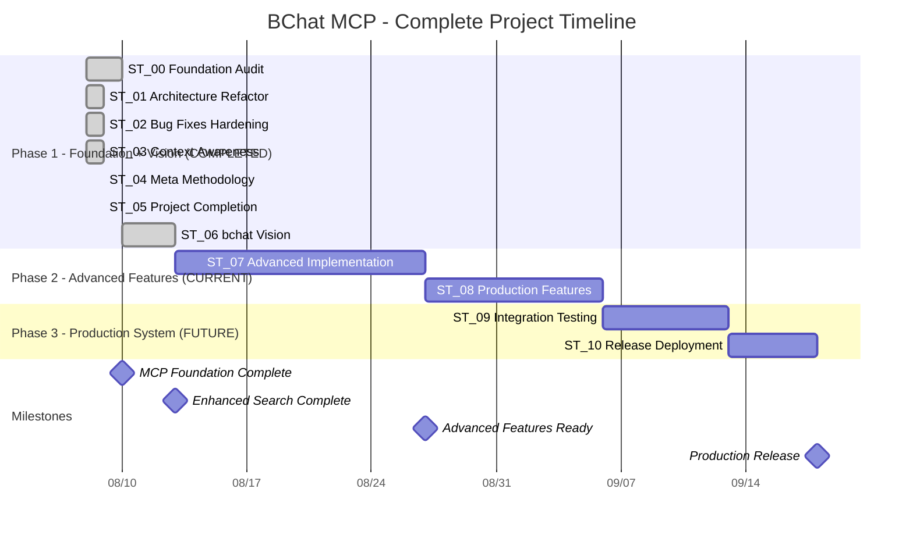

# BChat MCP - Stages Workflow Coordinator

**Document Type**: Datasheet & Reference  
**Location**: `/dev/dev_stages/stages_workflow.md`  
**Purpose**: Project coordination, status tracking, and stage management  
**Status**: ACTIVE - Updated continuously  
**Last Updated**: 2025-08-13  

## 🎯 **Project Vision**

Transform bchat from a context-aware chat processor into **BChat MCP** - a comprehensive AI collaboration platform enabling seamless multi-AI workflows, meta-methodology development, and machine-to-machine collaboration.

## 📊 **Project Status Dashboard**

### **Overall Project Status**: 75/100 - VISION_COMPLETE_ENHANCED_SEARCH_DELIVERED
- **Current Stage**: ST_06 bchat Vision Complete (90/100), Planning ST_07
- **Stages Completed**: 2/11 (ST_00 Foundation + ST_06 Vision)
- **Next Milestone**: ST_07 Advanced Implementation (ST_01-05 Feature Rescue)
- **Critical Path**: MCP Foundation ✅ → Enhanced Search ✅ → Advanced Features

### **Stage Status Overview**
```
ST_00_Foundation_Audit:           95/100 - COMPLETED   - MCP server + enhanced search ✅
ST_01_Architecture_Refactor:      60/100 - HISTORICAL - API parsing + memory analysis ✅
ST_02_Bug_Fixes_and_Hardening:    40/100 - HISTORICAL - Daemon setup + context audit ✅  
ST_03_Context_Awareness_Proposal: 50/100 - HISTORICAL - Deep context proposals ✅
ST_04_Meta_Methodology_Engine:    20/100 - HISTORICAL - Minimal implementation concepts ✅
ST_05_Project_Completion_Summary: 60/100 - HISTORICAL - Project reviews + strategy ✅
ST_06_bchat_Vision:               90/100 - COMPLETED  - RAG analysis + enhanced search ✅
ST_07_Advanced_Implementation:    00/100 - PLANNING   - ST_01-05 rescued features
ST_08_Production_Features:        00/100 - PROPOSED   - Advanced capabilities
ST_09_Integration_Testing:        00/100 - PROPOSED   - End-to-end validation
ST_10_Release_Deployment:         00/100 - PROPOSED   - Production deployment
```

## 🏗️ **System Architecture Framework**

### **1. Unified llm.txt Structure**
- **Master llm.txt**: `/llm.txt` - Workspace-wide contextual memory
- **Stage-Specific**: `/dev/dev_stages/ST_XX/llm.txt` - Per-stage context
- **Links**: Referenced from `/dev/INITIAL.md` and `/README.md`
- **Eliminates**: Redundant `claude.md` file

### **2. Stage-Specific Memory System**
```
/dev/dev_stages/
├── stages_workflow.md           # This coordinator document
├── ST_00_Foundation_Audit/
│   ├── llm.txt                  # Stage contextual memory (AI assistant only)
│   ├── 00_foundation_audit_plan.md
│   ├── 01_audit_report.md
│   ├── ...
│   └── NN-YYMMDD-descriptive_name.md  # Sequential work documentation
├── ST_01_Architecture_Refactor/
│   ├── llm.txt                  # Stage contextual memory (AI assistant only)
│   └── NN-YYMMDD-descriptive_name.md  # Sequential work documentation
└── [ST_02 through ST_10...]
```

### **3. Stage Documentation Pattern**

**For Existing Stages (Legacy Pattern)**:
- Keep existing numbered documents (00_, 01_, 02_...) unchanged
- Continue with new work using NN-YYMMDD-descriptive_name.md format
- Add llm.txt for AI assistant contextual memory only

**For New Stages**:
- Use NN-YYMMDD-descriptive_name.md format from the start
- Include llm.txt for AI assistant contextual memory

**llm.txt Content Requirements**:
- Current status score (0-100)
- Progress description and stage summary
- Key decisions and implementation details
- Integration points with other stages
- Next steps and completion criteria
- AI assistant working context and notes

## 📏 **Comprehensive Status Scale**

### **Status Range Definitions**
```
00-19: PROPOSED     - Initial concept, needs approval
20-39: PLANNING     - Requirements defined, architecture planned
40-59: IN_PROGRESS  - Active development, partially functional
60-79: FUNCTIONAL   - Core features work, needs refinement
80-89: VALIDATED    - Tested, documented, checkpoint passed
90-100: COMPLETED   - Production-ready, fully integrated
```

### **Status Progression Requirements**
- **00→20**: Concept approval & requirements definition
- **20→40**: Architecture design & implementation planning
- **40→60**: Core functionality development
- **60→80**: Testing, debugging, and refinement
- **80→90**: Validation, documentation, and checkpoint approval
- **90→100**: Integration, production readiness, and final approval

## 🎯 **Iterative Implementation Strategy**

### **Phase 1: MCP Foundation (ITER_01)**
- **Stages**: ST_00 → ST_03
- **Goal**: Establish working MCP server with bchat context capabilities
- **Deliverable**: MCP server serving chat history to Claude Code/Gemini CLI

### **Phase 2: Intelligence Layer (ITER_02)**  
- **Stages**: ST_04 → ST_07
- **Goal**: Advanced AI collaboration and meta-learning features
- **Deliverable**: Multi-AI coordination and autonomous session management

### **Phase 3: Production System (ITER_03)**
- **Stages**: ST_08 → ST_10  
- **Goal**: Production-ready deployment with full testing
- **Deliverable**: Stable, secure AI collaboration platform

## ✅ **Gate-Controlled Progression Protocol**

### **Stage Advancement Requirements**
1. **MVP Requirements Met**: Minimum viable functionality achieved
2. **Testing Complete**: All stage tests passing
3. **Documentation Updated**: Status, progress, and learnings documented
4. **Explicit Approval**: Coordinator approval required for advancement
5. **Checkpoint Validation**: Stage deliverables verified

### **Approval Gate Process**
1. **Stage Completion**: Developer declares stage ready
2. **Status Review**: Coordinator reviews progress and deliverables
3. **Testing Validation**: Automated and manual tests executed
4. **Documentation Check**: All required documentation complete
5. **Explicit Approval**: Coordinator provides go/no-go decision
6. **Progression**: Advance to next stage or iterate current stage

## 🔄 **Continuous Tracking Framework**

### **Status Tracking Enhancement**
```markdown
## Master Status Dashboard (in /llm.txt)
**Project**: BChat MCP Development
**Overall Progress**: [XX]/100 - [STATUS_CATEGORY]

### Stage Progress
- ST_00_Core_Architecture: [STATUS]/100 - [DESCRIPTION] - [BLOCKERS]
- ST_01_Memory_System: [STATUS]/100 - [DESCRIPTION] - [BLOCKERS]
- [Continue for all stages...]

### Current Focus
- **Active Stage**: ST_XX
- **Primary Goal**: [CURRENT_OBJECTIVE]
- **Next Milestone**: [NEXT_TARGET]
- **Estimated Completion**: [DATE/TIMEFRAME]
```

### **Checkpoint Validation Framework**
Each stage requires:
- **Functional Requirements**: Core features working as specified
- **Test Coverage**: All critical paths validated
- **Documentation**: Architecture, usage, and maintenance docs
- **Integration**: Compatibility with existing system
- **Performance**: Meets specified performance criteria
- **Coordinator Approval**: Explicit go-ahead from project coordinator

## 🛡️ **Risk Management & Rollback Safety**

### **Backup Strategy**
- **Stage Checkpoints**: Complete backup at each stage completion
- **Incremental Saves**: Regular progress snapshots
- **Rollback Points**: Safe restoration points every 20 status points

### **Risk Mitigation**
- **Scope Control**: Maximum effort limits per stage to prevent over-engineering
- **Dependency Mapping**: Clear understanding of stage interdependencies  
- **Testing Strategy**: Comprehensive test suite per stage
- **Documentation Requirements**: Continuous documentation to prevent knowledge loss

## 📊 **Project-Wide Implementation Timeline**



## 📋 **Next Immediate Steps**

### **Immediate Actions Required**
1. **ST_07 Planning**: Implement rescued ST_01-05 features as Advanced Implementation
   - Session Memory (ST_01): Cross-session persistence
   - Daemon Architecture (ST_02): Background process management  
   - Advanced Context (ST_03): Claude internal files integration
   - Project Analysis (ST_04): Development pattern extraction
   - Production Testing (ST_05): Real-world validation framework
2. **Enhanced Search Validation**: Benchmark current capabilities with production data
3. **ST_06 Completion**: Document enhanced search improvements in README

### **Pending Decisions**
- **Scope Limits**: Time/effort boundaries per stage
- **Testing Approach**: Stage-specific vs. milestone-based testing
- **Integration Strategy**: How stages connect and depend on each other

## 📈 **Success Metrics**

### **Quantitative Targets**
- **Stage Completion Rate**: Target 1 stage per iteration cycle
- **Status Progression**: Minimum 20 points advancement per review
- **Quality Gate**: 90%+ test coverage before stage completion
- **Documentation Coverage**: 100% of public APIs documented

### **Qualitative Goals**
- **System Stability**: No regressions in completed stages
- **Code Quality**: Maintainable, readable, and well-architected code
- **User Experience**: Intuitive and efficient workflow
- **AI Collaboration**: Seamless multi-AI interaction capabilities

---

## 📝 **Coordinator Notes**

**Document Usage**: This datasheet should be:
- Read before each development session
- Updated after each significant progress
- Referenced for all stage advancement decisions
- Used as the single source of truth for project status

**Maintenance Protocol**: 
- Update status scores after each work session
- Document blockers and dependencies immediately
- Review and refine scope as understanding evolves
- Maintain historical record of decisions and changes

**Communication Protocol**:
- Share updates with all team members (Human, Claude, Gemini)
- Use this document as the basis for status reports
- Reference stage numbers and status scores in all discussions
- Maintain consistency across all project documentation

---

**End of Stages Workflow Datasheet**  
**Next Update Required**: After ST_07 Advanced Implementation planning complete

## 🔄 **Development Philosophy Evolution**

### **Vision-First + Feature Rescue Approach**
The bchat project evolved through a successful **Vision-First Development** methodology:

1. **ST_00**: Established MCP foundation with enhanced search ✅
2. **Bypass ST_01-05**: Initially seemed premature without architectural vision
3. **ST_06**: Comprehensive vision analysis and practical implementation ✅
4. **Feature Rescue**: ST_01-05 analysis revealed valuable production-ready features
5. **ST_07**: Integration of rescued features as Advanced Implementation

### **Key Learnings**
- **Vision-First Prevents Over-Engineering**: ST_06 analysis informed better decisions
- **Historical Stages Contain Value**: ST_01-05 have production-ready features
- **Enhanced Search Foundation**: Proven architecture enables advanced features
- **Safe Integration Protocols**: Prevent destructive development practices

### **Current Capabilities (Production Ready)**
- **MCP Server**: JSON-RPC 2.0, STDIO transport, 18/18 tests passing ✅
- **Enhanced Search**: Stop words + recency scoring + multi-factor relevance ✅
- **Cross-AI Integration**: Claude Code + Gemini CLI via MCP protocol ✅
- **Chat History Management**: JSON-based conversation indexing and retrieval ✅
- **Context Intelligence**: Advanced context extraction with Claude.md parsing ✅
- **Safety Protocols**: Safe branch integration preventing destructive merges ✅
- **Professional Architecture**: BASE_DIR patterns, error handling, comprehensive testing ✅
- **Performance**: <100ms response times, Python stdlib only ✅